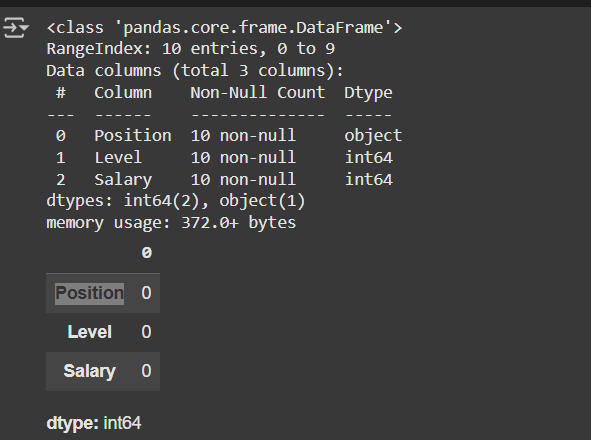
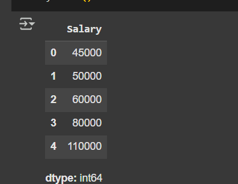
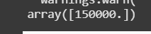

# Implementation-of-Decision-Tree-Regressor-Model-for-Predicting-the-Salary-of-the-Employee

## AIM:
To write a program to implement the Decision Tree Regressor Model for Predicting the Salary of the Employee.

## Equipments Required:
1. Hardware – PCs
2. Anaconda – Python 3.7 Installation / Jupyter notebook

## Algorithm
```
1. 1.Import pandas as pd
2. Import Decision tree classifier
3. Fit the data in the model
4. Find the accuracy score
```

## Program:
```
/*
Program to implement the Decision Tree Regressor Model for Predicting the Salary of the Employee.
Developed by: PAUL SHERVIN P
RegisterNumber:  212224240111
*/
```
```
import pandas as pd
df=pd.read_csv("/content/Salary.csv")
df.head()
df.info()
df.isnull().sum()
```
```
from sklearn.preprocessing import LabelEncoder
le=LabelEncoder()
df["Position"]=le.fit_transform(df["Position"])
df.head()
```
```
x=df[['Position','Level']]
x.head()
y=df['Salary']
y.head()
```
```
from sklearn.model_selection import train_test_split
x_train,x_test,y_train,y_test=train_test_split(x,y,test_size=0.2,random_state=100)
```
```
from sklearn.tree import DecisionTreeRegressor
dt=DecisionTreeRegressor()
dt.fit(x_train,y_train)
y_pred=dt.predict(x_test)
y_pred
from sklearn.metrics import r2_score
r2=r2_score(y_test,y_pred)
r2
```
```
dt.predict([[5,6]])
```

## Output:



## Result:
Thus the program to implement the Decision Tree Regressor Model for Predicting the Salary of the Employee is written and verified using python programming.
